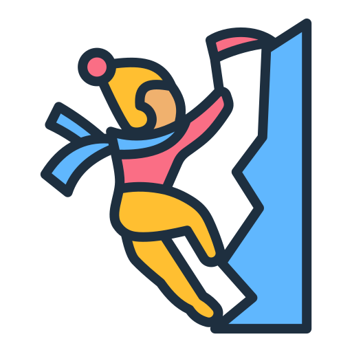

<h3>
    📈 저는 데이터를 통해  "왜?"라는 질문을 던지는 개발자입니다 👩‍🚀
</h3>

### 🛝 Hobby

<table>
    <thead>
        <tr>
            <th>

</th>
            <th>

</th>
        </tr>
    </thead>
    <tbody>
        <tr>
            <td >
#클라이밍
</td>
            <td>
#밴드
</td>
        </tr>
    </tbody>

</table>

### 📘 History

<table>
  <thead>
    <tr>
      <th>근무처</th>
      <th>프로젝트</th>
      <th>기간</th>
    </tr>
  </thead>
  <tbody>
    <tr>
      <td>역학연구실</td>
      <td>대한민국 식품/의약품 데이터베이스 구축</td>
      <td>2022.9 ~ 2022.10</td>
    </tr>
    <tr>
      <td>한국식품진흥원</td>
      <td>아데닌 독성기준 수립</td>
      <td>2023.7 ~ 2023.8</td>
    </tr>
    <tr>
      <td>서울대학교병원</td>
      <td>당뇨 영양지원 환자를 위한 ONS 결정모델</td>
      <td>2024.9 ~ 2024.12</td>
    </tr>
  </tbody>
</table>

### 💻 Tech

### 🛠️ Tools

### ✉️ Contact

<!--
**kyun9-cloud/kyun9-cloud** is a ✨ _special_ ✨ repository because its `README.md` (this file) appears on your GitHub profile.

Here are some ideas to get you started:

- 🔭 I’m currently working on ...
- 🌱 I’m currently learning ...
- 👯 I’m looking to collaborate on ...
- 🤔 I’m looking for help with ...
- 💬 Ask me about ...
- 📫 How to reach me: ...
- 😄 Pronouns: ...
- ⚡ Fun fact: ...
-->

